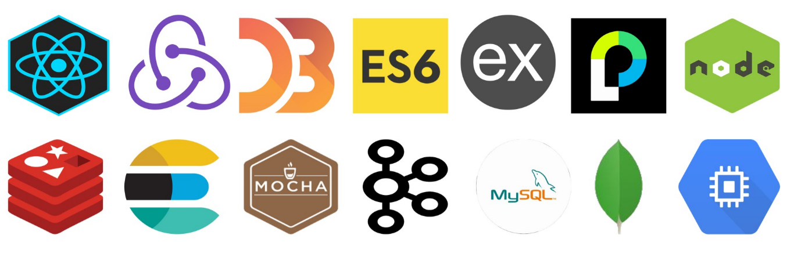
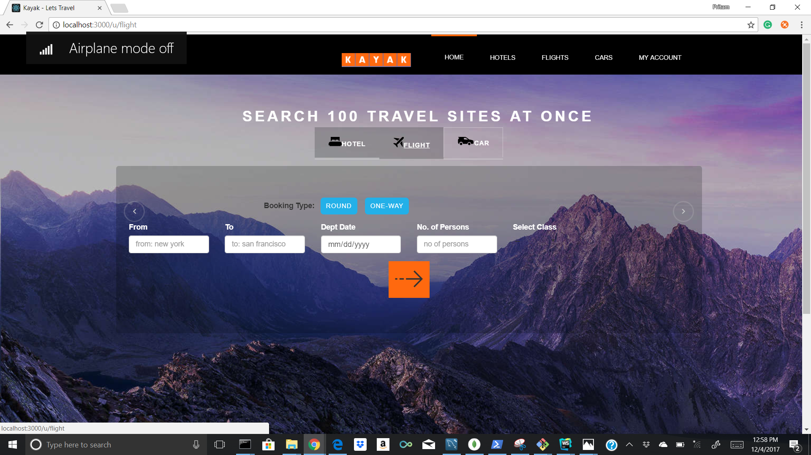
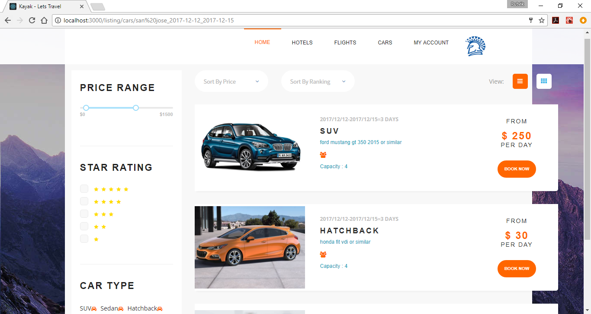
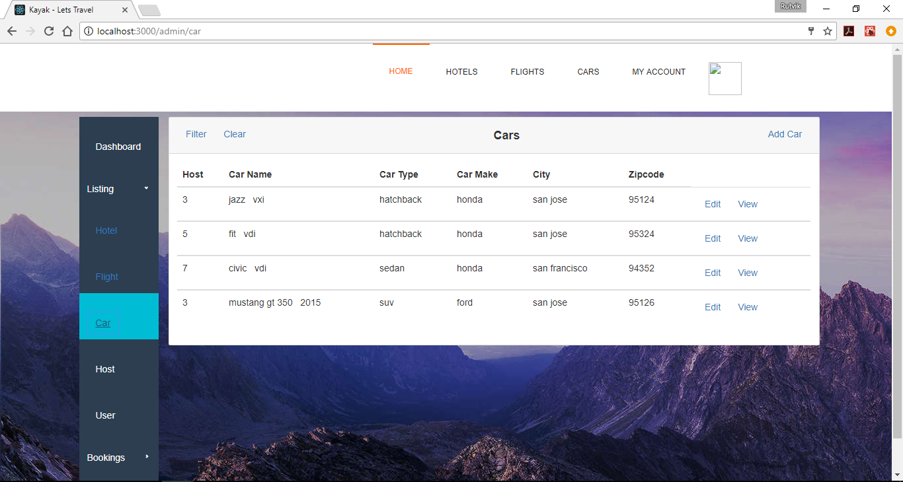

# Kayak-Travel-Reservation
A Kayak.com like web travel reservation application using MERN stack | Apache Kafka | Elasticsearch | Redis

## Goal

* The goal is to build a distributed enterprise web application which enables users to search for Cars, Hotels and Flights and make a booking but also login/signup along with editing user preferences and viewing travel history. As well as create a Admin side which can be used to add/edit/delete Flights, Cars and Hotels and also be able to delete the user and view the analytics/statistics.

* The project was developed using MERN stack with the use of distributed publish-subscribe messaging system like Apache Kafka along with a variety of other technologies like Elasticsearch, Redis, mocha etc.

## System Design

### Technology stack

<table>
<thead>
<tr>
<th>Area</th>
<th>Technology</th>
</tr>
</thead>
<tbody>
	<tr>
		<td>Front-End</td>
		<td>React, Redux, React Router, Bootstrap, HTML5, CSS3, Javascript ( ES6 )</td>
	</tr>
	<tr>
		<td>Analytics Graphs</td>
		<td>D3.js</td>
	</tr>
	<tr>
		<td>Message-oriented middleware</td>
		<td>Apache Kafka</td>
	</tr>
	<tr>
		<td>Authentication Middleware</td>
		<td>Passport.js</td>
	</tr>
	<tr>
		<td>Back-End</td>
		<td>Express, Node.js</td>
	</tr>
	<tr>
		<td>In-Memory Caching / Datastore</td>
		<td>Redis</td>
	</tr>
	<tr>
		<td>Search and Analytics Engine</td>
		<td>Elasticsearch</td>
	</tr>
	<tr>
		<td>API Testing</td>
		<td>Mocha, Postman</td>
	</tr>
	<tr>
		<td>Performance Testing</td>
		<td>JMeter</td>
	</tr>
	<tr>
		<td>Database</td>
		<td>MySQL (Google Cloud Platform), MongoDB (Mongo Atlas on AWS)</td>
	</tr>
    <tr>
		<td>Deployment</td>
		<td>Google Compute Engine</td>
	</tr>
</tbody>
</table>

## Screenshots

##### Login/Signup

##### Home - Hotels

##### Home - Flights

##### Home - Cars

##### Hotel Listing

##### Car Listing

##### Flight Listing

##### Booking page

##### User Home

##### Analytics

##### Admin Flight - Add/Edit/Search

##### Admin Hotel - Add/Edit/Search

##### Admin Car - Add/Edit/Search

### Performance comparison

> This Performance comparison graph for four criterias 
> 1. Without kafka, connection pooling or redis
> 2. With kafka but no connection pooling and redis.
> 3. With kafka and connection pooling but no redis.
> 4. With kafka, connection pooling and redis.
